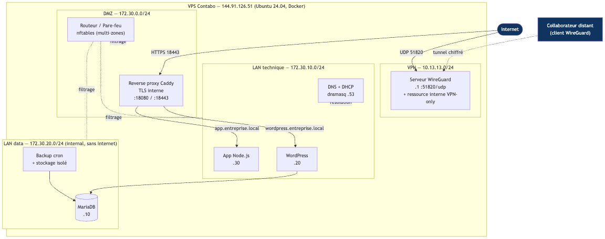
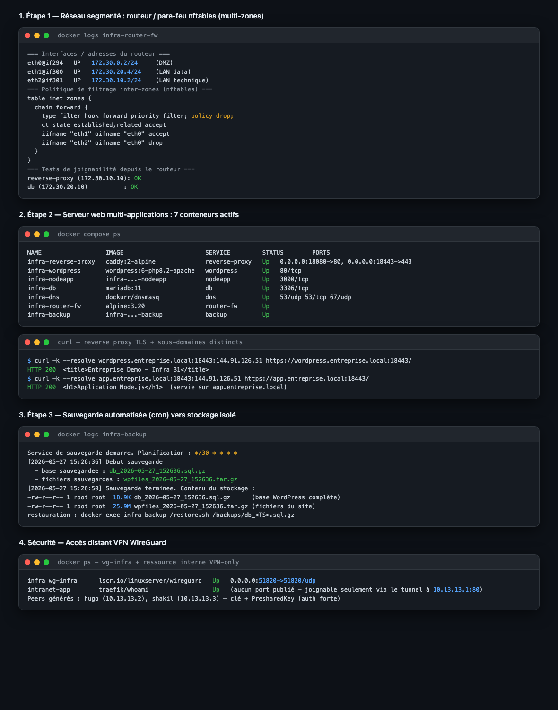
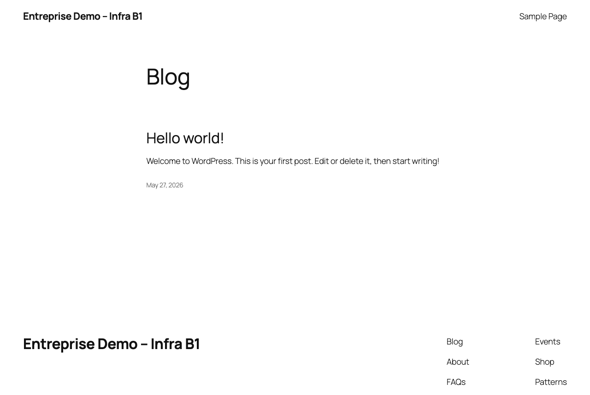
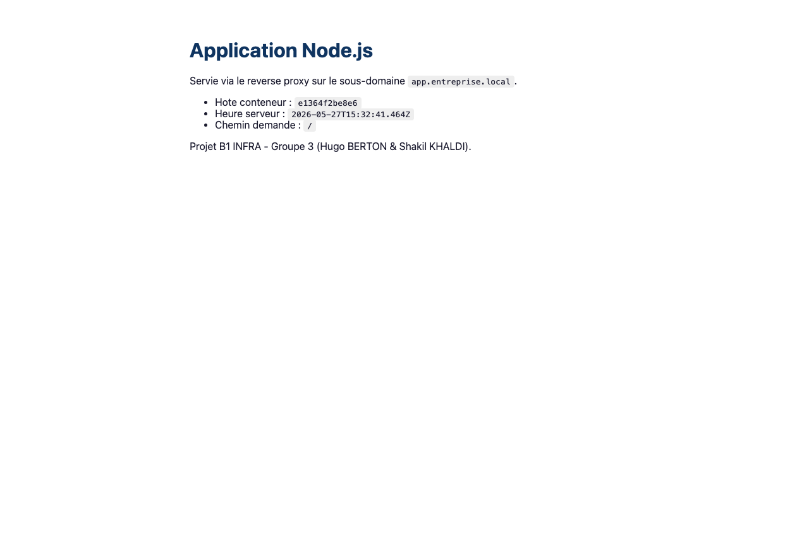
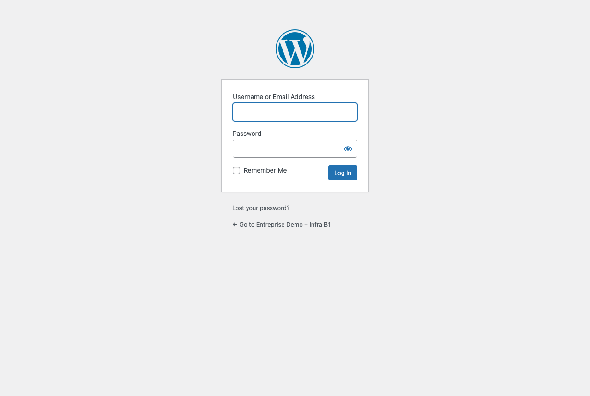

# Preuves de réalisation (captures)

Captures à inclure dans le rendu final et à projeter à l'oral.

## Schéma d'architecture / flux complet

## 1. Preuves techniques (réseau, conteneurs, sauvegarde, VPN)

## 2. Application 1 — WordPress (HTTPS, sous-domaine `wordpress.entreprise.local`)

## 3. Application 2 — Node.js (HTTPS, sous-domaine `app.entreprise.local`)

## 4. Sécurité — accès administration WordPress (authentification)

---
*Les deux applications sont servies par le **même** reverse proxy Caddy en HTTPS (CA interne),
sur deux sous-domaines distincts — preuve du serveur web multi-applications (Étape 2).*
