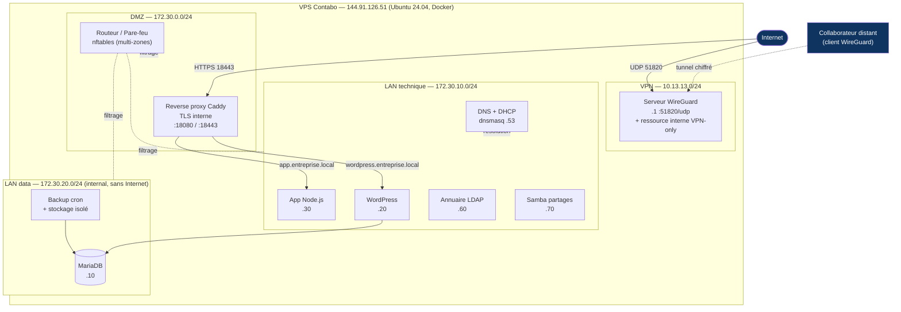

# Schéma réseau

## Légende
- **DMZ** : exposition contrôlée (reverse proxy + routeur/pare-feu).
- **LAN technique** : serveurs applicatifs + services réseau (DNS/DHCP).
- **LAN data** : base + sauvegarde, réseau `internal` (aucune route Internet sortante).
- **VPN** : accès distant chiffré ; la ressource interne n'est joignable que par le tunnel.
- Seuls 3 ports sont exposés sur Internet : `18080/tcp`, `18443/tcp`, `51820/udp`.
